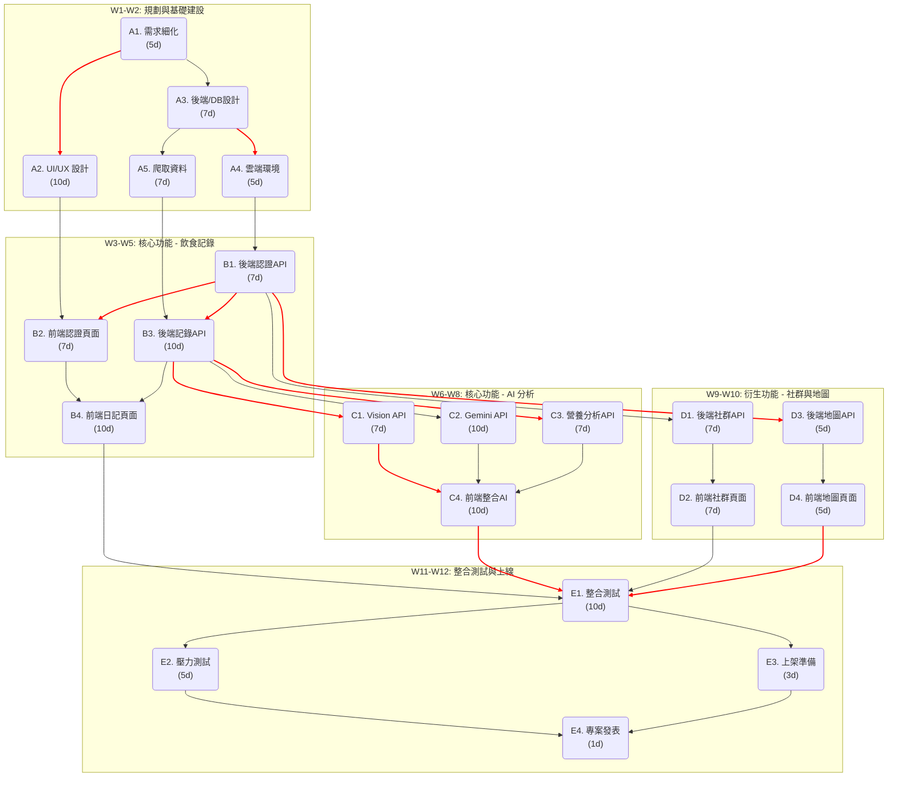

## AI 飲食控管 App (ai-diet-app)

這是一個結合 AI 技術的飲食控管 App 專案。本文件旨在追蹤專案時程與規劃。

| 學號 | 姓名 | 負責任務 | 
| :--- | :--- | :--- | 
| **C112118107** | **江夢千** | **後端** | |
| **C112118109** | **黃汶琁** | **後端** | |
| **C112118112** | **李晨華** | **前端** | |
---

## 專案時程總覽 (Gantt Chart)

**專案期間：** 2025/10/1 ~ 2025/12/21

| ID | 任務名稱 | 負責團隊 | 持續時間 (天) | 開始日期 | 結束日期 | 前置任務 |
| :--- | :--- | :--- | :--- | :--- | :--- | :--- |
| **A** | **階段一：規劃與基礎建設** | **全員** | **14** | **10/1** | **10/14** | |
| A1 | 專案啟動與需求細化 | 全員 | 5 | 10/1 | 10/7 | |
| A2 | UI/UX 設計 (Wireframe & Mockup) | 前端/設計 | 10 | 10/3 | 10/16 | A1 |
| A3 | 後端架構與資料庫 Schema 設計 | 後端 | 7 | 10/3 | 10/13 | A1 |
| A4 | 建立雲端環境 (GCP) 與 CI/CD | 後端 | 5 | 10/10 | 10/16 | A3 |
| A5 | 爬取/匯入食物營養資料庫 | 後端 | 7 | 10/10 | 10/20 | A3 |
| **B** | **階段二：核心功能 - 飲食記錄** | **全員** | **21** | **10/17** | **11/6** | **A** |
| B1 | 後端：使用者認證 API (註冊/登入) | 後端 | 7 | 10/17 | 10/25 | A4 |
| B2 | 前端：使用者認證頁面 | 前端 | 7 | 10/22 | 10/30 | A2, B1 |
| B3 | 後端：飲食記錄 CRUD API | 後端 | 10 | 10/24 | 11/6 | A5, B1 |
| B4 | 前端：飲食日記頁面與記錄功能 | 前端 | 10 | 10/29 | 11/11 | B2, B3 |
| **C** | **階段三：核心功能 - AI 智慧分析** | **全員** | **21** | **11/7** | **11/27** | **B** |
| C1 | 後端：串接 Vision API 圖像辨識 | 後端 | 7 | 11/7 | 11/17 | B3 |
| C2 | 後端：串接 Gemini API 飲食建議 | 後端 | 10 | 11/12 | 11/25 | B3 |
| C3 | 後端：每日營養缺口分析 API | 後端 | 7 | 11/12 | 11/20 | B3 |
| C4 | 前端：整合拍照辨識與 AI 建議 | 前端 | 10 | 11/18 | 12/1 | C1, C2, C3 |
| **D** | **階段四：衍生功能 - 社群與地圖** | **全員** | **14** | **11/28** | **12/11** | **C** |
| D1 | 後端：社群貼文/留言 API | 後端 | 7 | 11/28 | 12/8 | B1 |
| D2 | 前端：社群功能頁面 | 前端 | 7 | 12/1 | 12/11 | D1 |
| D3 | 後端：串接 Google Maps API | 後端 | 5 | 11/28 | 12/4 | B1 |
| D4 | 前端：地圖與店家推薦頁面 | 前端 | 5 | 12/3 | 12/9 | D3 |
| **E** | **階段五：整合測試與上線準備** | **全員** | **14** | **12/8** | **12/21** | **D** |
| E1 | 前後端整合測試與 Bug 修復 | 全員 | 10 | 12/8 | 12/19 | B4, C4, D2, D4 |
| E2 | 壓力測試與效能優化 | 後端 | 5 | 12/15 | 12/19 | E1 |
| E3 | 撰寫上架文件與 App Store 準備 | 全員 | 3 | 12/17 | 12/19 | E1 |
| E4 | **專案發表/結束** | **全員** | **1** | **12/21** | **12/21** | E2, E3 |

---

## 專案相依性與要徑圖 (PERT/CPM Chart)

此圖顯示了任務之間的依賴關係，紅色的路徑為本專案的「要徑 (Critical Path)」，任何延遲都將影響最終交付日期。

