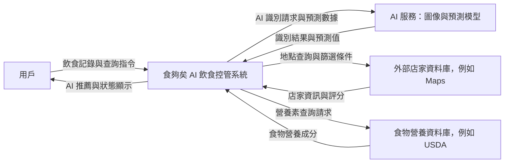
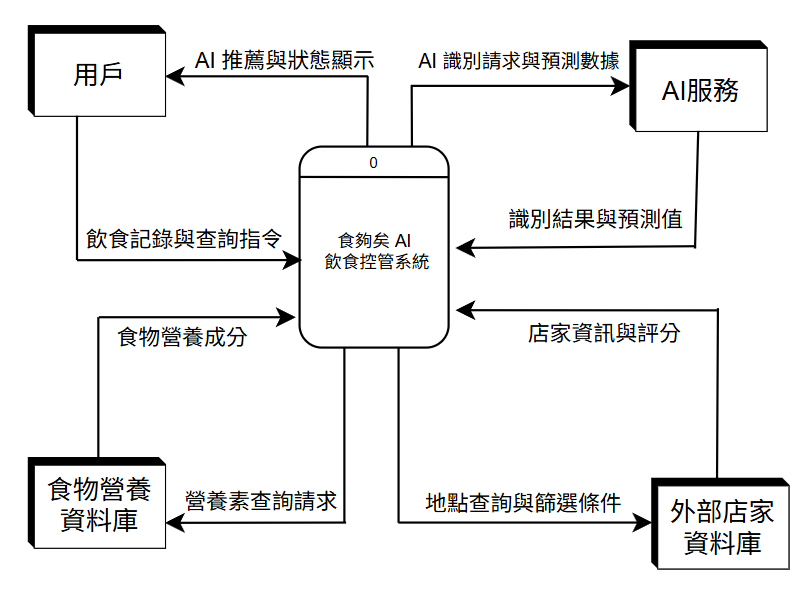
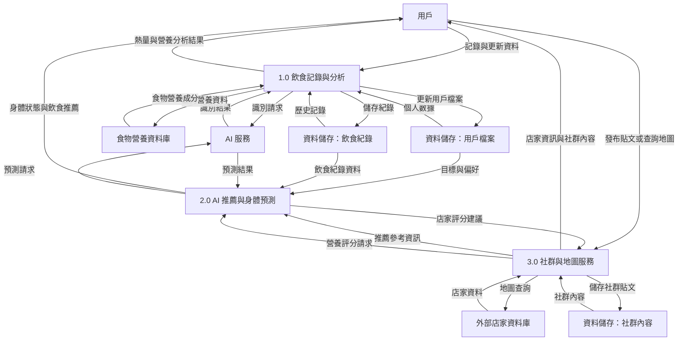
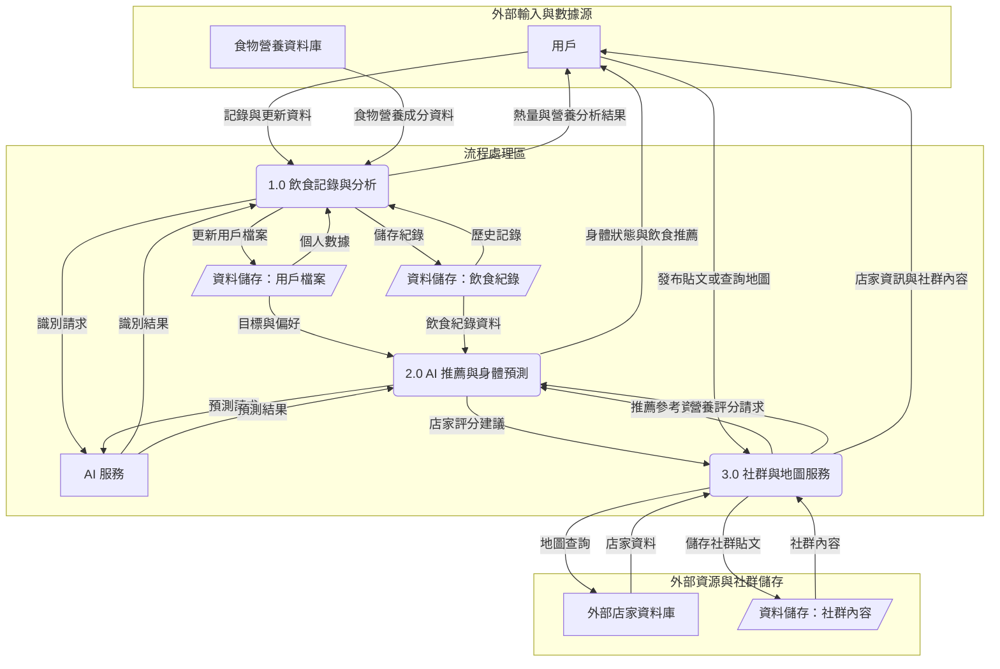
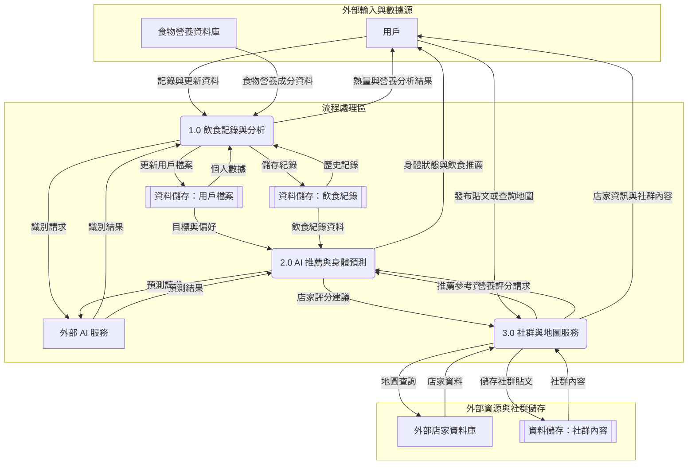
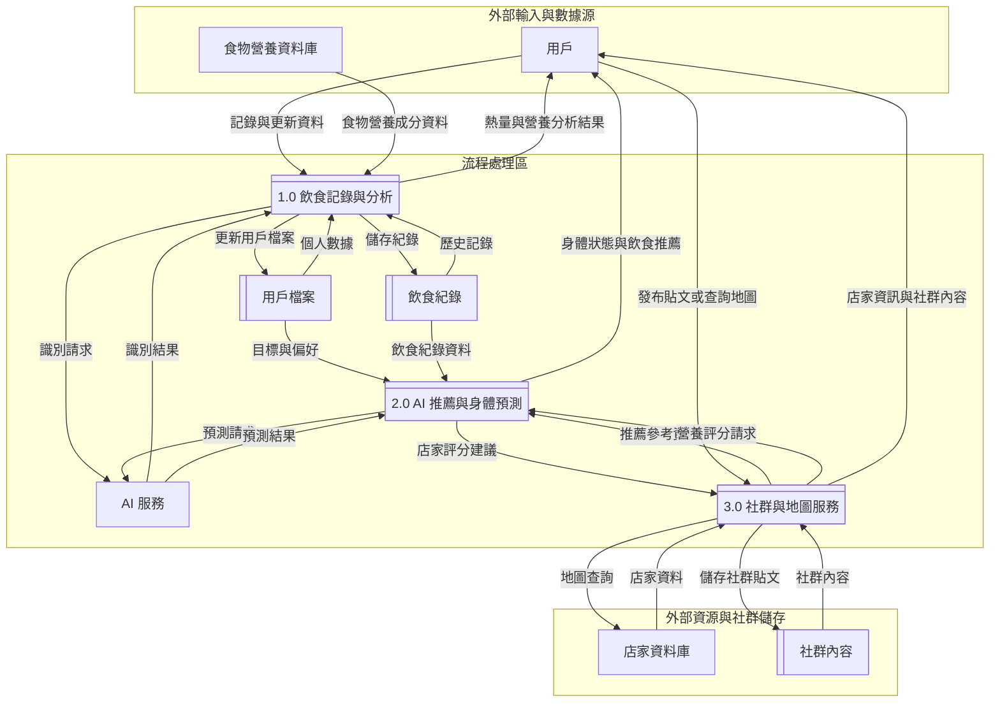

# 系統環境圖 (DFD)

```mermaid
graph LR
    %% 外部實體 (External Entities)
    A[用戶]
    B[AI 服務：圖像與預測模型]
    C[外部店家資料庫，例如 Maps]
    D[食物營養資料庫，例如 USDA]

    %% 系統 (System)
    E[食夠矣 AI 飲食控管系統]

    A -->|飲食記錄與查詢指令| E
    E -->|AI 推薦與狀態顯示| A

    E -->|AI 識別請求與預測數據| B
    B -->|識別結果與預測值| E

    E -->|地點查詢與篩選條件| C
    C -->|店家資訊與評分| E

    E -->|營養素查詢請求| D
    D -->|食物營養成分| E
```

# DFD 圖0

```mermaid
graph TD
    %% 外部實體
    A[用戶]
    B[AI 服務]
    C[外部店家資料庫]
    D[食物營養資料庫]

    %% 資料儲存
    D1[資料儲存：用戶檔案]
    D2[資料儲存：飲食紀錄]
    D3[資料儲存：社群內容]

    %% 處理流程
    P1[1.0 飲食記錄與分析]
    P2[2.0 AI 推薦與身體預測]
    P3[3.0 社群與地圖服務]

    %% 用戶輸入輸出
    A -->|記錄與更新資料| P1
    A -->|發布貼文或查詢地圖| P3
    P1 -->|熱量與營養分析結果| A
    P2 -->|身體狀態與飲食推薦| A
    P3 -->|店家資訊與社群內容| A

    %% P1 流程
    P1 -->|識別請求| B
    B -->|識別結果| P1
    P1 -->|查詢營養資料| D
    D -->|食物營養成分| P1
    D1 -->|個人數據| P1
    P1 -->|儲存紀錄| D2
    D2 -->|歷史記錄| P1
    P1 -->|更新用戶檔案| D1

    %% P2 流程
    D1 -->|目標與偏好| P2
    D2 -->|飲食紀錄資料| P2
    P2 -->|預測請求| B
    B -->|預測結果| P2
    P3 -->|推薦參考資訊| P2

    %% P3 流程
    P3 -->|地圖查詢| C
    C -->|店家資料| P3
    P3 -->|儲存社群貼文| D3
    D3 -->|社群內容| P3
    P3 -->|營養評分請求| P2
    P2 -->|店家評分建議| P3
```

```mermaid
graph TD
    %% 外部實體 & 資料儲存 (放在頂部/左側)
    subgraph 外部輸入與數據源
        A[用戶]
        D[食物營養資料庫]
    end

    subgraph 流程處理區
        %% 處理流程 P1 (飲食記錄與分析)
        P1(1.0 飲食記錄與分析)
        A -->|記錄與更新資料| P1
        D -->|食物營養成分資料| P1
        P1 -->|熱量與營養分析結果| A

        %% P1 互動 D1, D2
        D1[/資料儲存：用戶檔案/]
        D2[/資料儲存：飲食紀錄/]
        P1 -->|儲存紀錄| D2
        D2 -->|歷史記錄| P1
        P1 -->|更新用戶檔案| D1
        D1 -->|個人數據| P1

        %% P1 互動 AI 服務
        B[AI 服務]
        P1 -->|識別請求| B
        B -->|識別結果| P1
        
        %% 流程處理 P2 (AI 推薦與身體預測)
        P2(2.0 AI 推薦與身體預測)
        
        D1 -->|目標與偏好| P2
        D2 -->|飲食紀錄資料| P2
        
        P2 -->|預測請求| B
        B -->|預測結果| P2
        
        P2 -->|身體狀態與飲食推薦| A

        %% 流程處理 P3 (社群與地圖服務)
        P3(3.0 社群與地圖服務)

        P3 -->|推薦參考資訊| P2
        P2 -->|店家評分建議| P3
        P3 -->|營養評分請求| P2

        A -->|發布貼文或查詢地圖| P3
        P3 -->|店家資訊與社群內容| A
    end

    subgraph 外部資源與社群儲存
        C[外部店家資料庫]
        D3[/資料儲存：社群內容/]
        P3 -->|地圖查詢| C
        C -->|店家資料| P3
        P3 -->|儲存社群貼文| D3
        D3 -->|社群內容| P3
    end
```

```mermaid
graph TD
   %% === 外部實體 & 資料來源 ===
    subgraph 外部輸入與數據源
        A[用戶]
        D[食物營養資料庫]
    end

    %% === 流程處理區 ===
    subgraph 流程處理區
        %% 處理流程 P1 (飲食記錄與分析)
        P1(1.0 飲食記錄與分析)
        A -->|記錄與更新資料| P1
        D -->|食物營養成分資料| P1
        P1 -->|熱量與營養分析結果| A

        %% P1 互動 D1, D2 (資料儲存)
        D1[[資料儲存：用戶檔案]]
        D2[[資料儲存：飲食紀錄]]
        P1 -->|儲存紀錄| D2
        D2 -->|歷史記錄| P1
        P1 -->|更新用戶檔案| D1
        D1 -->|個人數據| P1

        %% P1 互動外部 AI 服務
        B[外部 AI 服務]
        P1 -->|識別請求| B
        B -->|識別結果| P1

        %% 處理流程 P2 (AI 推薦與身體預測)
        P2(2.0 AI 推薦與身體預測)
        D1 -->|目標與偏好| P2
        D2 -->|飲食紀錄資料| P2
        P2 -->|預測請求| B
        B -->|預測結果| P2
        P2 -->|身體狀態與飲食推薦| A

        %% 處理流程 P3 (社群與地圖服務)
        P3(3.0 社群與地圖服務)
        P3 -->|推薦參考資訊| P2
        P2 -->|店家評分建議| P3
        P3 -->|營養評分請求| P2

        A -->|發布貼文或查詢地圖| P3
        P3 -->|店家資訊與社群內容| A
    end

    %% === 外部資源與社群儲存 ===
    subgraph 外部資源與社群儲存
        C[外部店家資料庫]
        D3[[資料儲存：社群內容]]
        P3 -->|地圖查詢| C
        C -->|店家資料| P3
        P3 -->|儲存社群貼文| D3
        D3 -->|社群內容| P3
    end
```

```mermaid
flowchart TD
 subgraph s1["外部輸入與數據源"]
        A["用戶"]
        D["食物營養資料庫"]
  end
 subgraph s2["流程處理區"]
        P1["1.0 飲食記錄與分析"]
        D1["用戶檔案"]
        D2["飲食紀錄"]
        B["AI 服務"]
        P2["2.0 AI 推薦與身體預測"]
        P3["3.0 社群與地圖服務"]
  end
 subgraph s3["外部資源與社群儲存"]
        C["店家資料庫"]
        D3["社群內容"]
  end
    A -- 記錄與更新資料 --> P1
    D -- 食物營養成分資料 --> P1
    P1 -- 熱量與營養分析結果 --> A
    P1 -- 儲存紀錄 --> D2
    D2 -- 歷史記錄 --> P1
    P1 -- 更新用戶檔案 --> D1
    D1 -- 個人數據 --> P1
    P1 -- 識別請求 --> B
    B -- 識別結果 --> P1
    D1 -- 目標與偏好 --> P2
    D2 -- 飲食紀錄資料 --> P2
    P2 -- 預測請求 --> B
    B -- 預測結果 --> P2
    P2 -- 身體狀態與飲食推薦 --> A
    P3 -- 推薦參考資訊 --> P2
    P2 -- 店家評分建議 --> P3
    P3 -- 營養評分請求 --> P2
    A -- 發布貼文或查詢地圖 --> P3
    P3 -- 店家資訊與社群內容 --> A
    P3 -- 地圖查詢 --> C
    C -- 店家資料 --> P3
    P3 -- 儲存社群貼文 --> D3
    D3 -- 社群內容 --> P3

    P1@{ shape: div-proc}
    D1@{ shape: lin-proc}
    D2@{ shape: lin-proc}
    P2@{ shape: div-proc}
    P3@{ shape: div-proc}
    D3@{ shape: lin-proc}


```
