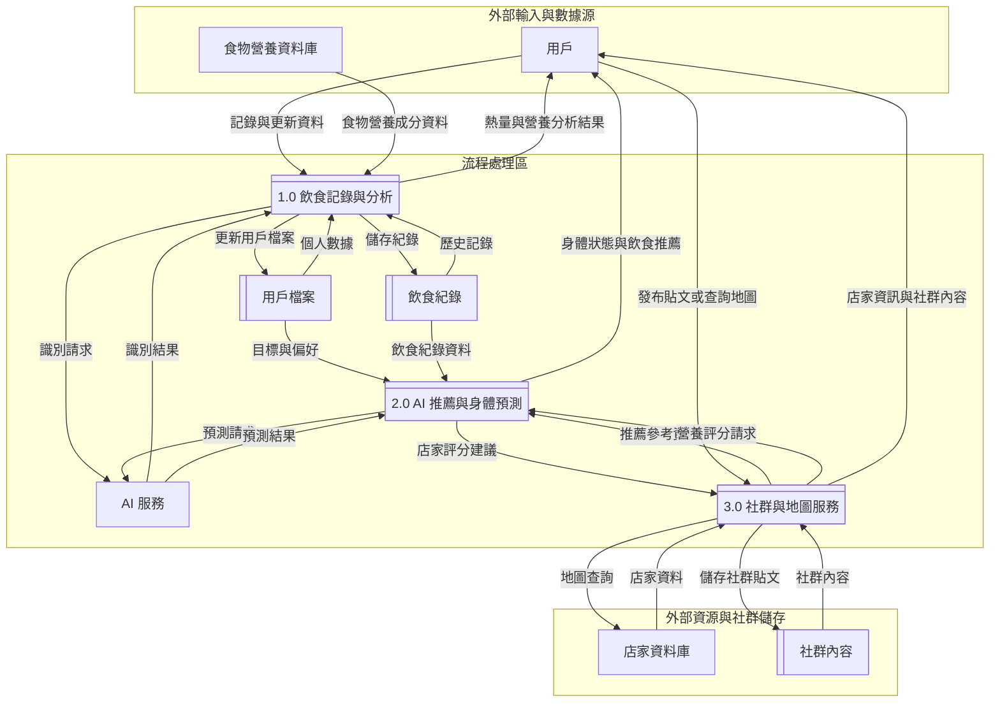

# 系統環境圖 (DFD)

# DFD 圖0

```mermaid
flowchart TD
 subgraph s1["外部輸入與數據源"]
        A["用戶"]
        D["食物營養資料庫"]
  end
 subgraph s2["流程處理區"]
        P1["1.0 飲食記錄與分析"]
        D1["用戶檔案"]
        D2["飲食紀錄"]
        B["AI 服務"]
        P2["2.0 AI 推薦與身體預測"]
        P3["3.0 社群與地圖服務"]
  end
 subgraph s3["外部資源與社群儲存"]
        C["店家資料庫"]
        D3["社群內容"]
  end
    A -- 記錄與更新資料 --> P1
    D -- 食物營養成分資料 --> P1
    P1 -- 熱量與營養分析結果 --> A
    P1 -- 儲存紀錄 --> D2
    D2 -- 歷史記錄 --> P1
    P1 -- 更新用戶檔案 --> D1
    D1 -- 個人數據 --> P1
    P1 -- 識別請求 --> B
    B -- 識別結果 --> P1
    D1 -- 目標與偏好 --> P2
    D2 -- 飲食紀錄資料 --> P2
    P2 -- 預測請求 --> B
    B -- 預測結果 --> P2
    P2 -- 身體狀態與飲食推薦 --> A
    P3 -- 推薦參考資訊 --> P2
    P2 -- 店家評分建議 --> P3
    P3 -- 營養評分請求 --> P2
    A -- 發布貼文或查詢地圖 --> P3
    P3 -- 店家資訊與社群內容 --> A
    P3 -- 地圖查詢 --> C
    C -- 店家資料 --> P3
    P3 -- 儲存社群貼文 --> D3
    D3 -- 社群內容 --> P3

    P1@{ shape: div-proc}
    D1@{ shape: lin-proc}
    D2@{ shape: lin-proc}
    P2@{ shape: div-proc}
    P3@{ shape: div-proc}
    D3@{ shape: lin-proc}


```
