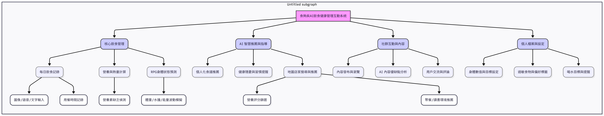
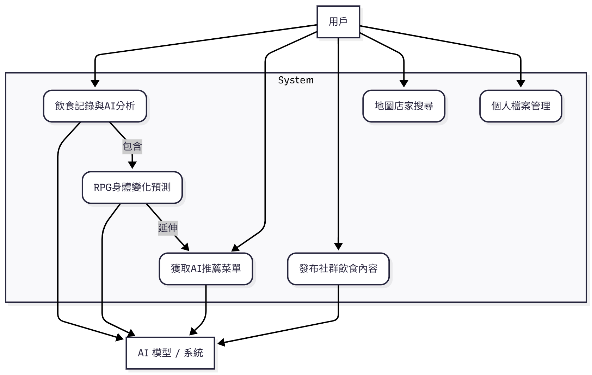

# 食夠矣 - AI 飲食控管App功能性需求與非功能性需求

### 一、功能性需求 (Functional Requirements / FR)

#### 1. 核心飲食記錄與分析 (Core Logging & Analysis)

* **系統** 必須允許用戶透過**圖像（拍照）**、**語音**或**文字**輸入方式記錄餐點。
* **AI 模型** 必須自動識別食物、計算**總熱量**及**三大營養素**，並將結果即時顯示給用戶。
* **系統** 必須以**記帳模式**儲存每日每餐的飲食紀錄。
* **系統** 必須偵測並顯示用戶在單日或累積期間**缺乏或過量攝取的營養素**，並主動提示。

#### 2. RPG 式身體狀態與預測 (RPG Status & Prediction)

* **系統** 必須根據最新的飲食紀錄和個人檔案，**預測短期的身體數值波動**（如體重、水腫程度或能量水平）。
* **系統** 必須以**紙娃娃系統或遊戲化介面**呈現身體狀態的變化與趨勢，增加趣味性。
* **系統** 必須允許用戶**手動更新**體重、身高、體脂等個人基礎數據。

#### 3. AI 智慧推薦與地圖服務 (AI Recommendation & Map Service)

* **AI 模型** 必須根據用戶的飲食目標、當日已攝取熱量和缺乏營養素，推薦下一餐的**飲食內容**（包含食譜或推薦店家）。
* **系統** 必須提供**地圖搜索功能**，允許用戶依據位置搜尋店家。
* **系統** 必須支持按**價格帶**、**AI 營養評分**、**適合聚餐人數**等條件對店家進行篩選和排序。
* **系統** 必須定期提醒或建議用戶**避免的飲食習慣**（如冷熱交替）或潛在的**健康隱憂**。

#### 4. 社交與內容分享 (Social & Content Sharing)

* **系統** 必須允許用戶發布飲食內容、探店心得或吃播影片到社群。
* **AI 模型** 必須對用戶發布的**飲食內容進行自動分析**，並提供**優缺點報告**（例如：評估食物衛生區分、份量適當性）。
* **系統** 必須提供基本的**按讚、評論和分享**功能，促進用戶互動。

---

### 二、非功能性需求 (Non-Functional Requirements / NFR)

#### 1. 性能 (Performance)

* **AI 識別速度：** **AI 飲食圖像識別和熱量計算** 必須在 **3 秒內** 完成，以確保流暢的記錄體驗。
* **預測更新速度：** **RPG 身體狀態預測**結果應在飲食記錄完成後 **3 秒內** 更新。

#### 2. 安全性與隱私 (Security & Privacy)

* **數據加密：** 所有用戶的**健康數據**（體重、飲食記錄、目標）必須使用**SHA-256** 或更強算法加密儲存，並使用行業標準的加密技術進行傳輸。
* **傳輸安全：** **系統** 必須使用 **HTTPS 協議** 加密所有數據傳輸，確保客戶端與伺服器之間的通訊安全。
* **防護措施：** **系統** 應實施有效措施，防止 **SQL 注入**和 **跨站腳本攻擊**。

#### 3. 可用性與準確性 (Usability & Accuracy)

* **運行時間：** **系統** 應保持 **99.9%** 的運行時間 (Uptime)。
* **跨平台支援：** **系統** 應支持主流瀏覽器，包括 Chrome、Firefox、Safari 和 Edge 的最新版本。
* **數據準確度：** **食物資料庫中的熱量和營養成分準確度需達 95% 以上**，且需定期更新。

#### 4. 可擴展性與維護性 (Scalability & Maintainability)

* **水平擴展：** 系統架構必須能夠支援**百萬級**用戶規模，並支持**水平擴展**。
* **服務分離：** **AI 模型服務** 應與核心應用服務分離，以便獨立擴展和部署。
* **錯誤日誌：** 系統代碼應遵循行業標準的編碼規範，**系統** 應提供詳細的**錯誤日誌**。

使用案例名稱: **發布社群飲食內容**
行動者: 用戶、AI 模型 / 系統
說明: 用戶在飲食社群發布飲食內容，系統與 AI 對該內容進行健康優缺點分析。
完成動作: 
1. 用戶點擊「發布」按鈕，並上傳內容（圖片/文字/影片）。
2. **AI 模型** 對飲食內容進行分析（冷熱交替、份量等）。
3. **系統** 將 AI 分析結果顯示在貼文下方（優點與建議）。
4. **系統** 成功發布貼文至社群。
替代方法: 
1. 用戶上傳內容。
2. **系統** 偵測內容**違反社群規範**或含有違禁詞。
3. **系統** 拒絕發布，並提示用戶修改內容。
先決條件: 用戶已登入系統。
後置條件: 貼文成功發布至社群，並附帶 AI 分析報告。
假設: 具備社群內容規範檢查功能。
